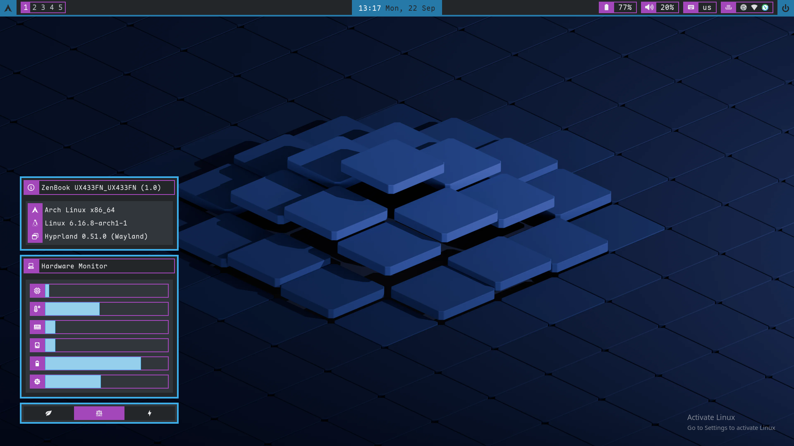

# Arch Linux Hyprland dotfiles

This repository contains dotfiles and programs used in my Arch Hyprland setup. The goal is to have fully fledged desktop environment.



## Arch Linux Desktop Environment

| Component                   |                                                   | Key bindings       |
| --------------------------- | ------------------------------------------------- | ------------------ |
| Application launcher        | `rofi`                                            | Super + D          |
| Audio control               | `pwvucontrol`, `cable`, `pipewire`, `wireplumber` |                    |
| Backlight control           | `brightnessctl`                                   |                    |
| Bluetooth manager           | `blueman`                                         |                    |
| Clipboard manager           | `cliphist`, `wl-clipboard`                        |                    |
| Display manager             | `ly`                                              |                    |
| Logout dialogue             | `nwg-bar`                                         | Super + Ctrl + P   |
| Network management          | `networkmanager`, `dhcpcd`                        |                    |
| Notification daemon         | `dunst`                                           |                    |
| Polkit authentication agent | `hyprpolkitagent`                                 |                    |
| Power control               | `power-profiles-daemon`                           |                    |
| Power management            | `poweralertd`                                     |                    |
| Taskbar                     | `waybar`                                          | Super + M (reload) |
| Terminal emulator           | `kitty`                                           | Super + Return     |
| Screen capture              | `grim`                                            |                    |
| Screen locker               | `hyprlock`, `hypridle`                            | Super + L          |
| Screen temperature          | `hyprsunset`                                      |                    |
| Shell                       | `fish`                                            |                    |
| Wallpaper setter            | `hyprpaper`                                       |                    |

### Additional applications

| Category             |                     |
| -------------------- | ------------------- |
| File manager         | `dolphin` (`ark`)   |
| Text editor          | `vscodium`, `zed`   |
| Internet browser     | `firefox`           |
| Document viewer      | `okular`            |
| Office applications  | `libreoffice-fresh` |
| Boot manager theming | `plymouth`          |

## Installation

### Requirements

As not all applications are available only in AUR an AUR helper is needed. In this case I use `yay`.

### Installation script

- The `install.sh` uses `pacman` and `yay` to install all apps I use or are necessary for the system. The `deploy.sh` script copies the `dotfiles` configs to the `.config` and based on some system parameters as `hostname` select appropriate files.

```
./install.sh
./deploy.sh
reboot
```

## Configuration

### In `.config`

- I use script that based on the name of the system, it loads the correct monitor layout. This is easily tweaked in the `config/hypr/monitors-<type>.conf` and `deploy.sh`

### Outside `.config`

- Selecting default applications `selectdefaultapplication-git`.

**Default applications**

- `~/.config/mimeapps.list` make symbolic link to the `/usr/share/applications/mimeapps.list`
- Also run:
  ```
  sudo pacman -S archlinux-xdg-menu
  XDG_MENU_PREFIX=arch- kbuildsycoca6
  ```

**Plymouth**

- `/etc/plymouth/plymouthd.conf`
- Add to `/etc/mkinitcpio.conf`
  ```
  ...
  HOOKS=(base udev autodetect plymouth ...)
  ...
  ```
- Set default theme with

  ```
  plymouth-set-default-theme hexagon_2
  ```

**GRUB**

- To enable the `plymouth`, splash option needs to be set in grub
- Additionally I use theme with `grub`
- `/etc/default/grub`

  ```
  ...
  GRUB_CMDLINE_LINUX_DEFAULT="... splash"
  ...
  GRUB_TERMINAL_OUTPUT=gfxterm
  ...
  GRUB_THEME="/boot/grub/themes/minegrub-world-selection/theme.txt"
  ```

- Then to generate config

  ```
  sudo grub-mkconfig -o /boot/grub/grub.cfg
  ```

  **Pipewire**

- To enable default higher sampling rate
- `~/.config/pipewire/pipewire.conf`

  ```
  ...
  default.clock.rate          = 176000
  default.clock.allowed-rates = [ 44100 48000 88200 96000 176400 192000 352800 384000 705600 768000 ]
  ...
  ```

  **Bluetooth**

- To enable "smarter" behavior of some bluetooth devices
- `/etc/bluetooth/main.conf`
  ```
  ...
  FastConnectable = true
  ReconnectAttempts=7
  ReconnectIntervals=1, 2, 3
  ...
  ```

**Steam**

- To easily enable `pacman` multilib use:

```
sudo sed -i -e '/#\[multilib\]/,+1s/^#//' /etc/pacman.conf
```

**Services**

- If using the `archinstall` with the Hyprland desktop option, `ly` is enable by default, otherwise it also needs to be enabled.

```
systemctl --user enable --now hyprpolkitagent.service
sudo systemctl enable --now power-profiles-daemon.service
sudo systemctl enable --now bluetooth.service
sudo systemctl enable --now NetworkManager
```

## Theme

- In order to set the same breeze theme in the QT and GTK, `qt6ct-kde` and `dconf-editor` need to be used
  - In the `qt6ct-kde` it's straightforward
  - In the `dconf-editor` these are the values to set:

    ```
    org.gnome.desktop.interface.color-sheme = 'prefer-dark'
    org.gnome.desktop.interface.gtk-theme = 'Breeze-Dark'
    org.gnome.desktop.interface.icon-theme = 'Papirus-Dark'
    ```

    - Ideally set stuff like default fonts and date formats...

## Miscellaneous Key Bindings

### Window notions

| Key bindings                 | Purpose                     |
| ---------------------------- | --------------------------- |
| Super + [number #]           | Switches to workplace #     |
| Super + Shift + [number #]   | Moves window to workplace # |
| Super + [arrow keys]         | Move window focus           |
| Super + Shift + [arrow keys] | Moves window                |
| Super + Ctrl + [arrow keys]  | Resizes window              |
| Super + Shift + Q            | Kills focused window        |
| Super + V                    | Toggle floating             |
| Super + F                    | Toggle fullscreen           |
| Super + T                    | Change the window layout    |
| Super + Mouse:left           | Move window                 |
| Super + Mouse:right          | Resize window               |

### Groups

| Key bindings | Purpose                                     |
| ------------ | ------------------------------------------- |
| Super + G    | Enable/disable group                        |
| Super + H    | Lock group                                  |
| Alt + Tab    | Switch to next window in a grout (rotation) |

### System

| Key bindings      | Purpose                                                              |
| ----------------- | -------------------------------------------------------------------- |
| Super + Space     | Switches language                                                    |
| Super + Ctrl + P  | Exit prompt (`nwg-bar`)                                              |
| Super + M         | Reloads `waybar`                                                     |
| Super + O         | If path is set correctly, deploys the config files into `~/.config/` |
| Super + U         | Reloads `eww`                                                        |
| Super + [fn keys] | Volume, brightness, player control                                   |
| Print screen      | Screenshot (should work :3)                                          |

### Czech bindings

- If using the Czech language, Hyprland doesn't recognize numbers for workspaces and these need to be used instead:

  ```
  plus   <=> 1
  ecaron <=> 2
  scaron <=> 3
  ccaron <=> 4
  rcaron <=> 5
  zcaron <=> 6
  yacute <=> 7
  aacute <=> 8
  iacute <=> 9
  eacute <=> 10
  ```
